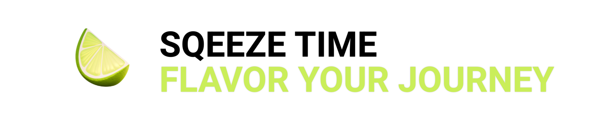
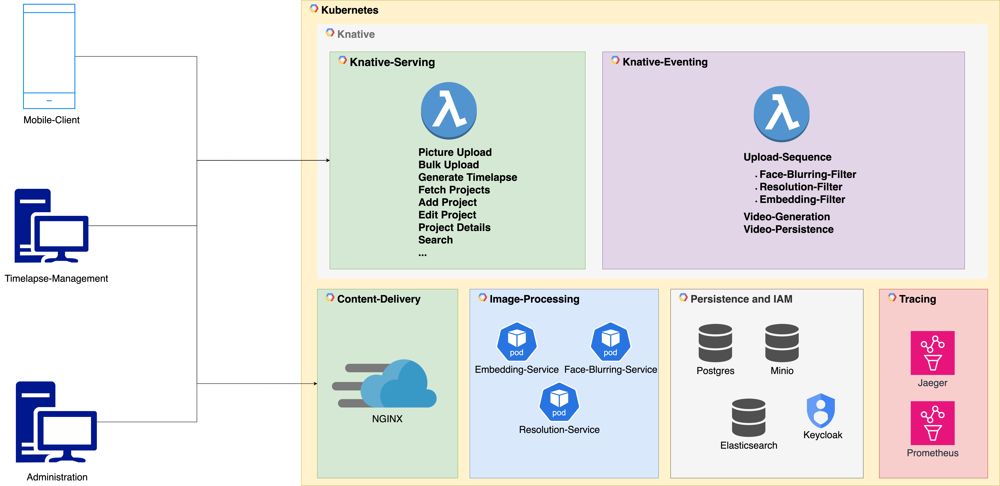
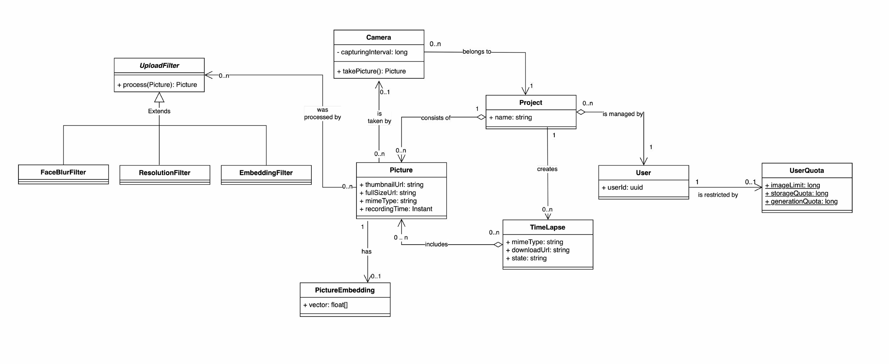
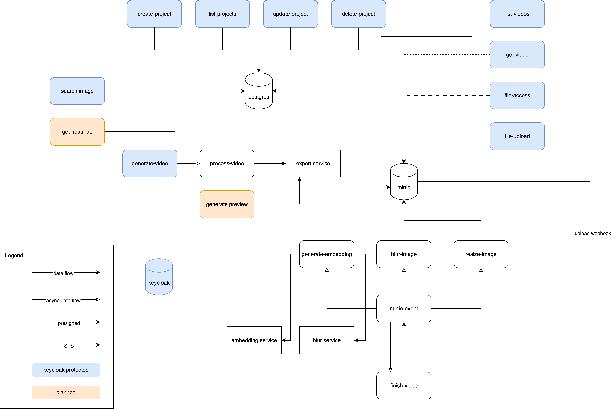

# LimeLapse



**Timelapse as a Service** — seamless timelapse creation at low cost, powered by serverless automation and AI-driven curation.

LimeLapse is a serverless, event-driven timelapse platform running on Knative + Kubernetes. It combines Quarkus functions, ML microservices, and web/mobile clients to ingest images, manage projects, and generate timelapse videos. From the UI you can create projects, upload frames, preview candidate sequences, and trigger on-demand renders while the backend handles storage, processing, and search.

> ⚠️ **Note:** This repository is a public mirror created for showcase purposes. The original development was conducted in an internal repository.

## Walkthrough

The walkthrough shows the complete flow from signing in to exporting a timelapse. It starts with authentication and project creation, then walks through manual image upload, timeline filtering, previewing candidate frames, and finally exporting the finished video. The semantic, CLIP-based search is used to remove low-quality frames (such as fully black images), keeping the output clean and cinematic. It also highlights how the UI stitches together multiple serverless endpoints (project management, file access, preview generation, and final renders) into a single, guided workflow.


## Example output

A sample timelapse shows a busy scene with people and movement captured across frames, highlighting how LimeLapse turns large, noisy image sets into a smooth, watchable video.


## Value proposition

- **Timelapse as a Service**: create, manage, and export timelapses without managing infrastructure.
- **AI-assisted curation**: full‑text, CLIP-based embeddings help filter out bad frames (e.g., fully black images).
- **Cost‑efficient by design**: scale‑to‑zero serverless architecture keeps costs low.

## Technical highlights

- **Self-contained serverless stack**: Knative Serving/Eventing with Kafka, MinIO, Postgres, Keycloak, and Jaeger runs locally via Minikube, including ingress and TLS for realistic local testing.
- **State-of-the-art AI models**: CLIP-based embedding search, MediaPipe face detection, and image processing services enable semantic search, privacy-safe exports, and quality filtering.
- **End-to-end workflow automation**: Minikube bootstrap scripts stand up the full stack, build all services, and deploy functions in one command.

## Architecture overview

- **Functions (Quarkus)**: serverless endpoints for upload, search, telemetry, previews, and video workflows.
- **ML services**: Python services that generate embeddings and perform face blurring for privacy-safe sharing.
- **Clients**: React web app and Ionic mobile app for capture and management.
- **Infrastructure**: Knative Serving/Eventing, Kafka broker, MinIO, Postgres, Keycloak, Jaeger.



The deployment diagram shows the fully self-contained stack running inside Kubernetes with ingress, identity, storage, and observability wired into the serverless workflow.

## Domain model



The domain model highlights how projects, images, timelapse jobs, and exports relate across the platform, making it clear where metadata, search, and media storage responsibilities live.

## Function breakdown



The function breakdown summarizes the serverless entry points that power uploads, project management, search, video generation, and telemetry ingestion.

## Repository layout

```
apps/
  quarkus-functions/      # Knative serverless functions (Quarkus)
  ml-services/            # ML microservices (embedding + blurring)
  web-client/             # React management UI
  mobile-client/          # Ionic/Capacitor mobile capture app
  function-health/        # Node health function for quick checks
infra/
  k8s/                    # Kubernetes manifests (MinIO, Postgres, Keycloak, etc.)
  knative/                # Knative + Kafka eventing manifests
  quarkus-functions/      # Function K8s manifests
  deploy-*.py             # Deployment helpers

development/
  install-dependencies.*  # Dependency bootstrap (macOS/Linux/Windows)
  run-minikube.py          # Orchestrates local Minikube environment
```

## Prerequisites

- [Docker](https://docs.docker.com/get-docker/)
- [Minikube](https://minikube.sigs.k8s.io/docs/start/)
- [kubectl](https://kubernetes.io/docs/tasks/tools/)
- [Python 3.10+](https://www.python.org/downloads/)
- [Node.js + npm](https://nodejs.org/en)

## Quick start (local Minikube)

### 1) Install dependencies

```bash
./development/install-dependencies.sh
```

> On Windows, use `./development/install-dependencies.ps1`

### 2) Start the cluster

```bash
python ./development/run-minikube.py up
```

### 3) Open the tunnel (required for ingress)

```bash
python ./development/run-minikube.py tunnel
```

### 4) Health check

```bash
curl -H "Host: function-health.limelapse.com" http://localhost/health
```

## Web client (local dev)

```bash
cd apps/web-client
npm install
npm run dev
```

### Optional checks

```bash
npm run fmt
npm run build
```

## ML services

ML services are configured via `apps/ml-services/services.yaml` and built/deployed by the Minikube setup script. Images are used for embedding similarity search and blurring workflows.

## Infrastructure tooling

- `development/run-minikube.py` orchestrates the full local stack.
- `infra/deploy-functions.py` builds and deploys Quarkus functions.
- `infra/deploy-ms.py` builds and deploys ML microservices.
- `infra/deploy-service.py` builds and deploys standalone services like `timelapse-export`.

## Authentication & storage

- **Keycloak** (`sso.limelapse.com`) provides user identity.
- **MinIO** stores project media; file access uses temporary S3 credentials.
- **Postgres** stores project metadata and telemetry.

## API overview

See `apps/API_DESCRIPTION.MD` for full endpoint and payload documentation. Core endpoints include:

- `upload.limelapse.com` — image upload via presigned URLs
- `files.limelapse.com` — MinIO access tokens
- `projects.limelapse.com` — project CRUD
- `search.limelapse.com` — similarity search + heatmap
- `video.limelapse.com` — timelapse generation + list
- `telemetry.limelapse.com` — device status updates

## Additional resources

- `apps/web-client/README.md` for frontend-specific tooling.
- `apps/mobile-client/README.md` for mobile setup.
- `development/run-minikube.py` for full cluster orchestration details.

## Contributors

This project was developed in collaboration with an exceptional team, consisting of:

* [Michael Helcig](https://github.com/helcig)
* [Florian Trimmel](https://github.com/dazwala)
* [Andreas Hofer](https://github.com/hoferand/)

**Built with ❤️ in 🇦🇹 at TU Wien.**


